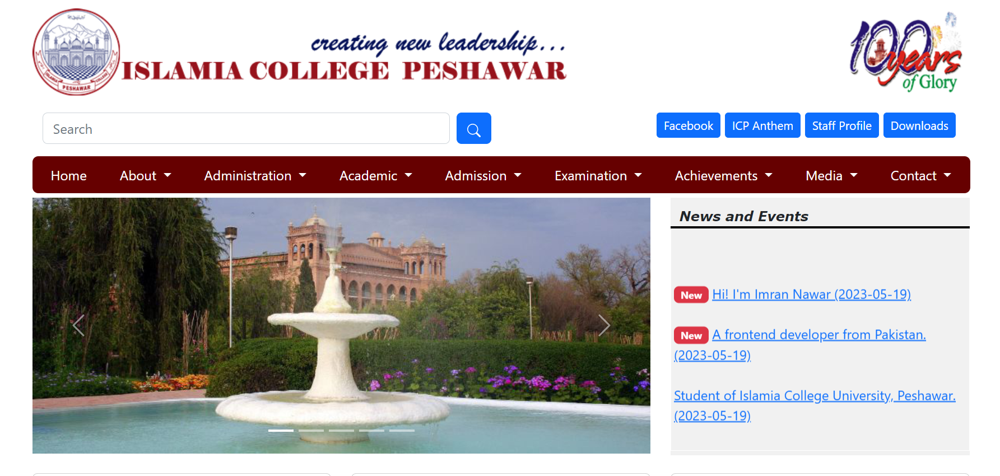

# Islamia College, Peshawar - Frontend Clone

This project is a clone of the frontend webpage of the official website of Islamia College, Peshawar. It is built using HTML, Bootstrap 5.3, and custom CSS styles.

[](https://imrannawar.github.io/Islamia-College-Peshawar/)

## Installation

To use or contribute to this project, follow these steps:

1. Clone the repository:
    ```
    git clone https://github.com/ImranNawar/Islamia-College-Peshawar.git
    ```

2. Navigate to the project directory:
   ```
   cd Islamia-College-Peshawar
   ```

## Usage

To view the cloned webpage, open the `index.html` file in your preferred web browser.

## Technologies Used

- HTML
- Bootstrap 5.3
- Custom CSS

## License

This project is licensed under the MIT License. See the [LICENSE](https://github.com/ImranNawar/Islamia-College-Peshawar/blob/main/LICENSE) file for details.

## Contributing

Contributions are always welcome! If you would like to contribute to this project, please fork the repository and submit a pull request.

## Acknowledgments

Special thanks to the official website of Islamia College, Peshawar for providing the design inspiration and reference for this project.
